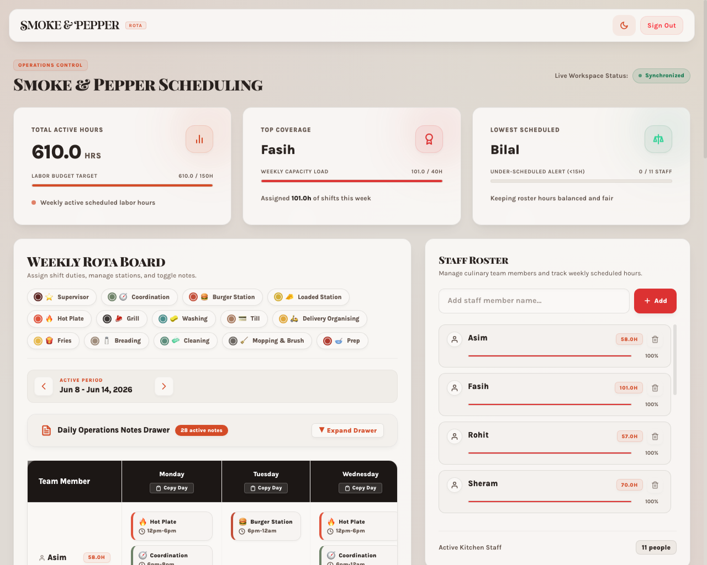

# 🍔 Smoke & Pepper Rota Manager

A premium, real-time employee scheduling and roster management platform tailored for restaurant staff and kitchen operations.

👉 **Live Application:** [https://rota-manager-5a47.web.app](https://rota-manager-5a47.web.app) (Secure Operations Control)



---

## 📖 The Problem & Story

In a busy kitchen environment like **Smoke & Pepper**, clear coordination is everything. Previously, our kitchen staff, chefs, and manager had a major pain point: **managing and sending the weekly rota manually**. 

The manager had to draft schedules manually, calculate hours on paper, and repeatedly rewrite text schedules to send in the team's WhatsApp group day-in and day-out. It was a tedious, time-consuming manual process that led to scheduling conflicts and miscommunication.

As a member of the kitchen staff and chef, I saw an opportunity to build a digital solution. Using my software development skills, I designed and built this **Rota Manager Web Application** to digitize our scheduling, automate hours calculations, and enable instant, formatted roster sharing.

---

## ⚡ The Solution & Key Features

This application transforms our kitchen scheduling workflow into a streamlined digital experience:

* **🔒 Operations Control (Firebase Auth):** Restricts management actions (adding/removing staff, editing shifts, changing notes) to authenticated managers, ensuring schedule integrity.
* **🔥 Real-time Database Synchronization (Firestore):** All scheduling changes sync instantly across devices. If the manager updates a shift, the team sees it in real time.
* **📅 Interactive Weekly Timetable Grid:** Drag/assign staff to color-coded kitchen stations (Supervisor, Grill, Prep, Burger Station, Loaded Station, Till, Fries, Breading, Cleaning, Washing, etc.) from Monday to Sunday.
* **💬 One-Click WhatsApp Exporter:** Instantly formats the day's or week's rota into a clean, structured, and emoji-decorated text message, copyable with a single click to be pasted directly into our WhatsApp group chat.
* **📊 Live Workload Dashboard:** Displays real-time metrics including total scheduled hours, most-scheduled staff, and least-scheduled staff to ensure fair distribution of shifts.
* **📝 Operations & Prep Notes:** Dedicated notes drawer for day-specific instructions (Opening, Prep, Extras, and Closing notes) to keep front-of-house and kitchen teams fully aligned.
* **🎨 Modern Responsive UI:** A premium glassmorphic interface with optimized mobile layouts, custom micro-interactions, and a native Dark/Light theme toggle.

---

## 🛠️ Tech Stack

* **Frontend:** React 19 + Vite
* **Styling:** Tailwind CSS (Modern HSL-tailored color systems & Glassmorphism)
* **Backend:** Firebase Authentication & Cloud Firestore (real-time sync)
* **Helpers:** HTML2Canvas (for future image-based exports), local storage caching

---

## 🚀 Getting Started

To run the application locally:

### 1. Clone the repository and install dependencies
```bash
npm install
```

### 2. Configure Firebase Environment
Ensure your Firebase Project configuration is set up in [src/firebase.js](src/firebase.js).

### 3. Run the Development Server
```bash
npm run dev
```
The app will start locally, typically at `http://localhost:5173/`.

### 4. Build for Production
```bash
npm run build
npm run preview
```
